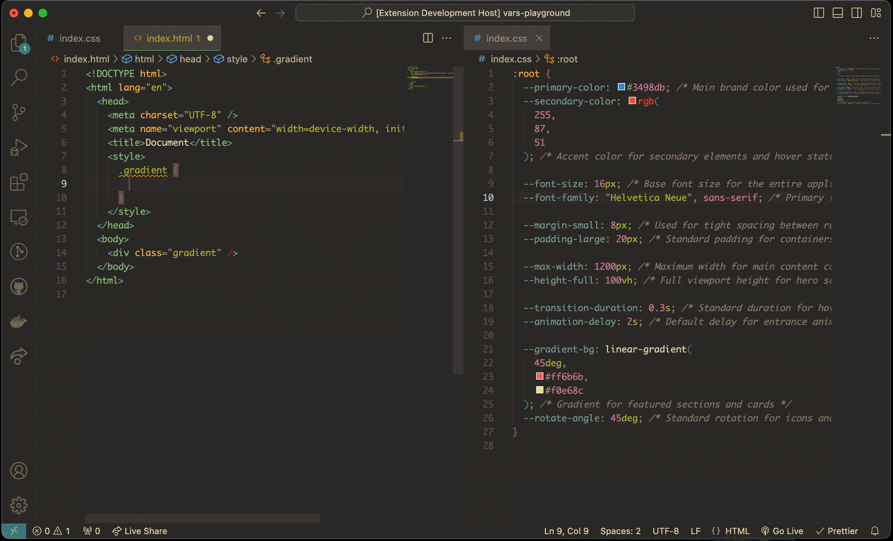

# CSS Variables Predictor

A Visual Studio Code extension that provides intelligent autocompletion for CSS custom properties (CSS variables) across your entire workspace. Get suggestions for all your CSS variables with their values and documentation while you type.

## Features

- 🎨 Auto-completion for CSS variables across your entire workspace
- 🌈 Special handling for color variables with color indicators
- 📝 Shows variable values and comments in completions
- 📍 Displays source file location for each variable
- 🔄 Real-time updates when CSS files change
- ⚡ Works in CSS, SCSS, LESS, HTML, JSX, TSX, and Astro files



## Usage

1. Start typing `var(` in any supported file
2. The extension will automatically show completions for all CSS variables defined in your workspace
3. Select a variable to insert it
4. Hover over a variable to see its value, documentation, and source location

Example completion:

```css
.example {
  /* Start typing var( here */
  color: var( /* Completions will appear */
}
```

## Supported File Types

- CSS (`.css`)
- SCSS (`.scss`)
- LESS (`.less`)
- HTML (`.html`)
- React (`.jsx`, `.tsx`)
- Astro (`.astro`)

## Variable Detection

The extension detects CSS variables defined in the following format:

```css
--variable-name: value; /* Optional comment */
```

It automatically indexes:

- Variable name
- Value
- Inline comments
- Source file and line number

## Features in Detail

### Smart Completions

- Shows variable name and value in the completion list
- Differentiates between color and other variables
- Provides inline preview for color values

### Documentation View

When you highlight a completion, you'll see:

```css
--variable-name         value
```

Along with:

- Any associated comments
- Source file location (`filename:line`)

### Real-time Updates

- Automatically detects changes to CSS files
- Updates completions when variables are added, modified, or removed
- Debounced updates to prevent performance issues

## Installation

1. Open VS Code
2. Go to Extensions (Ctrl+Shift+X / Cmd+Shift+X)
3. Search for "CSVars"
4. Click Install

## Configuration

Currently, the extension works out of the box with no configuration needed. It automatically scans all CSS, SCSS, and LESS files in your workspace for variables.

## Contributing

Contributions are welcome! Please feel free to submit a Pull Request. For major changes, please open an issue first to discuss what you would like to change.

1. Fork the repository
2. Create your feature branch (`git checkout -b feature/AmazingFeature`)
3. Commit your changes (`git commit -m 'Add some AmazingFeature'`)
4. Push to the branch (`git push origin feature/AmazingFeature`)
5. Open a Pull Request

## Known Issues

- When using completions within the same CSS file where variables are defined, VS Code's built-in completions may also appear. This is handled by filtering out current file variables to prevent duplicates.

## Release Notes

### 1.0.0

- Initial release
- Basic CSS variable completion
- Support for multiple file types
- Real-time file watching
- Documentation view with source information

## License

[MIT](LICENSE)

## Support

If you encounter any problems or have suggestions, please [open an issue](link-to-your-repo/issues) on our GitHub repository.

---

**Enjoy!** 🎨
